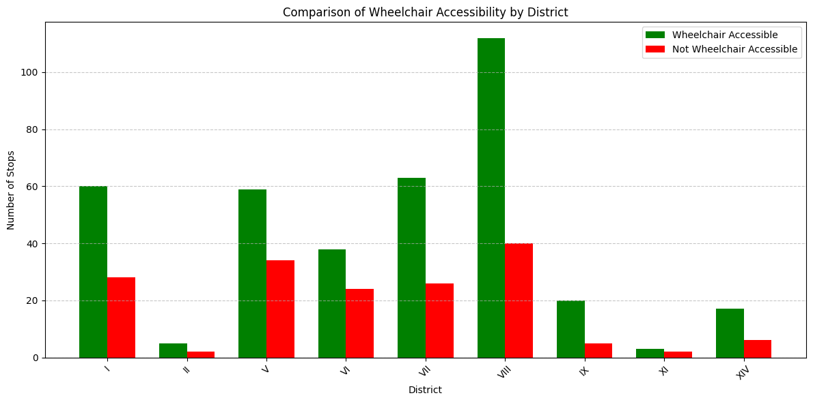
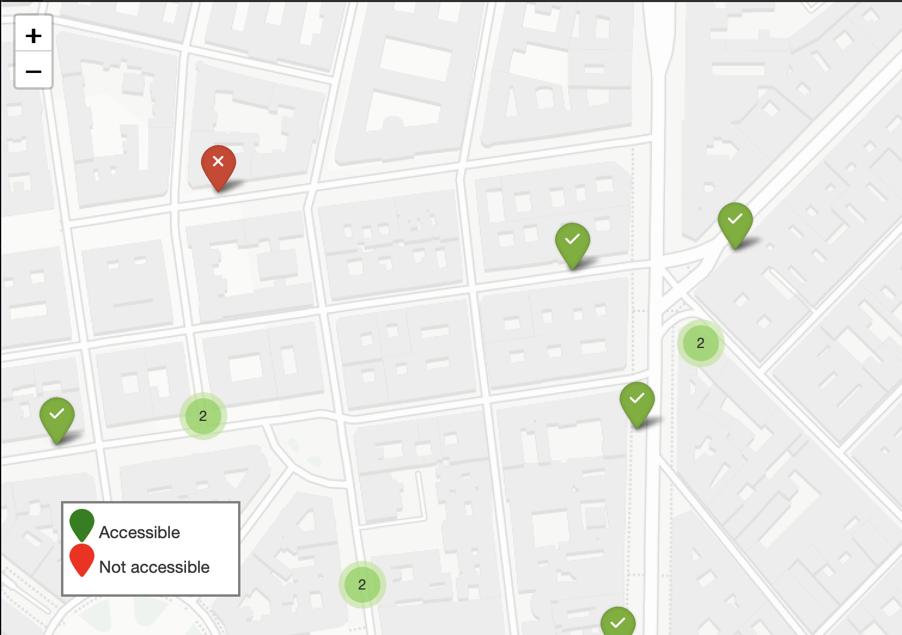

# Public Transport Accessibility Analysis in Budapest  

## Overview
This project analyzes wheelchair accessibility in Budapest's public transport system (**BKK**) using real-time data from the **BKK API**. It demonstrates my skills in **data collection, processing, analysis, and visualization** while tackling an important issue—improving accessibility in public transport.  

---

## Project Goals
- **Analyze wheelchair accessibility** across BKK's tram, bus, and metro network
- **Determine** the percentage of Budapest's public transport that is accessible
- **Map out** which stations can be reached from accessible starting points
- **Visualize** accessibility data clearly and effectively

---

## Skills & Tools Used
### **Data Collection & Processing**
- Integrated with the **BKK API** for real-time transport data  
- Cleaned & structured data using **Pandas**  
- Stored insights in **CSV files** for further analysis  

### **Data Analysis**

- Performed statistical analysis on **accessibility by district and transport type**  
- Compared **accessible vs. non-accessible stops**  
- Analyzed accessibility **district-wise** for deeper insights  

### **Data Visualization**

- Created **interactive maps** with **Folium** to highlight accessibility gaps  
- Built **bar charts & comparative graphs** using **Matplotlib**  
- Developed **custom visualization classes** for different perspectives  

### **Technical Implementation**
- Used **Python** with key libraries:
  - **Requests** → API integration  
  - **Pandas** → Data wrangling  
  - **Folium** → Mapping  
  - **Matplotlib** → Statistical visualizations  
- Followed an **object-oriented, modular coding approach** for maintainability  

---

## Key Findings
- **Total Stops Analyzed:** 544  
- **Wheelchair Accessible Stops:** 377 (69% of total)  
- **Most Accessible District:** District V (93 stops)  
- **Most Common Transport Type:** All 544 stops serve buses  

---

## Why This Matters
This analysis provides valuable insights that can help:
- **BKK & City Planners** → Identify and address accessibility gaps  
- **Policymakers** → Prioritize infrastructure improvements  
- **Citizens with mobility challenges** → Plan better routes with confidence  

---

## Project Structure
The Jupyter Notebook (`futar.ipynb`) includes:
1. **Fetching** data from the BKK API
2. **Processing & cleaning** the data
3. **Storing** insights for analysis
4. **Mapping & statistical visualizations**
5. **Key findings & recommendations**
